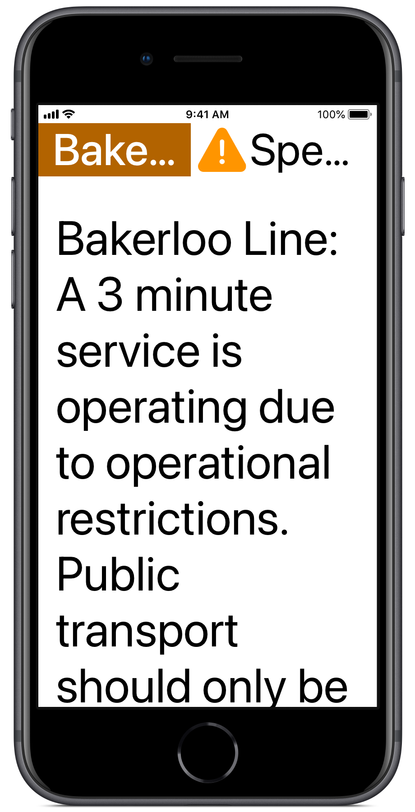
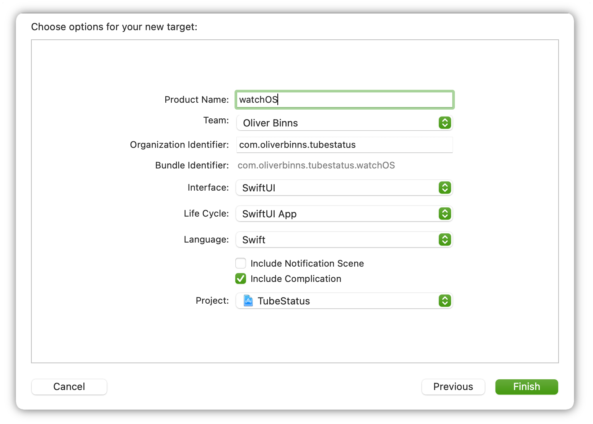
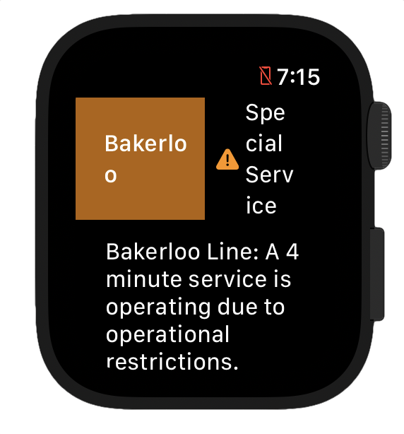
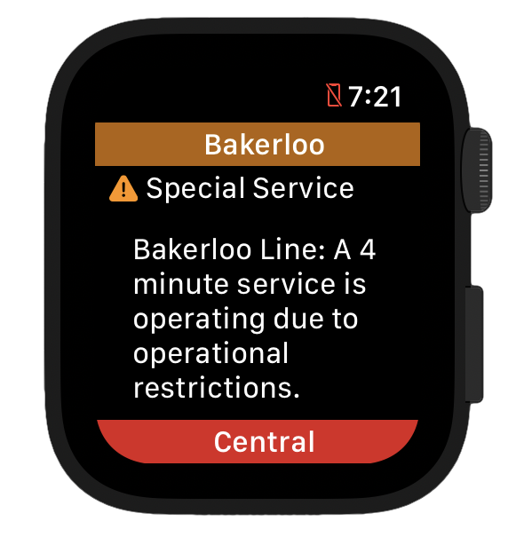
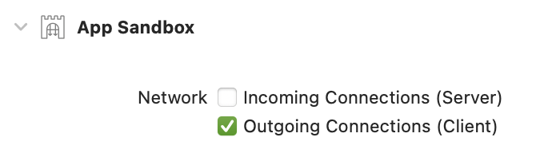
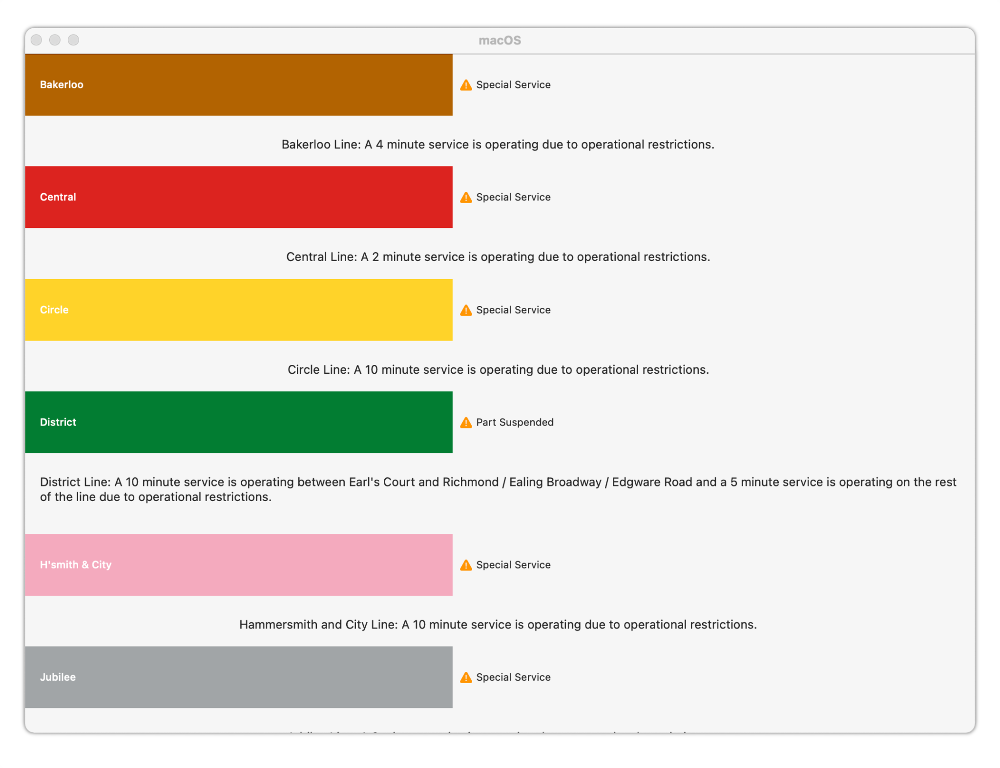

In a recently published [blog-post on building widgets for iOS 14](https://www.oliverbinns.co.uk/2020/06/27/create-a-tube-status-home-screen-widget-for-ios-14/), I showed how to implement a home-screen widget to display the latest status of the London Underground network. In the sample project, I showed how a shared module could be used to share everything from networking code to SwiftUI views between both the actual app and the widget.

Since SwiftUI is supported on all of Apple’s platforms, and we can now create apps _entirely_ with SwiftUI, I thought it would be interesting to see how easily we can adapt a similar app to support _all_ Apple platforms, be accessible for _all_ users, and implement as many flagship features as possible. SwiftUI makes it super easy to do this, but as developers we still need have each of these features at the back of our minds when we are working.

Sample code for this post is available on GitHub.

> prettylink https://github.com/Oliver-Binns/tube-status-ios
> image /Images/tube-status-ios-github.png
> title Oliver-Binns/tube-status-ios
> description A sample iOS app for displaying the status of the London Underground using WidgetKit. – Oliver-Binns/tube-status-ios

> prettylink https://developer.apple.com/documentation/swiftui/app-organization
> image /Images/apps-organisation-docs.png
> title App Structure and Behavior | Apple Developer Documentation
> description Define the entry point and top-level organization of your app.

## iOS
### WidgetKit / iOS

Let’s start assuming that we have implemented this, if you want more details on this, check out my previous blog post on the topic.

> prettylink /posts/tube-status-widget
> image /Images/roundel.png
> title Create a Tube Status home-screen Widget for iOS 14
> description In this article, I will detail how to quickly and easily create a home-screen widget for your app, using the London Underground status board as a real-world example.

### Dark Mode

In SwiftUI, we can implement dark mode very easily as part of our existing work. In-fact, when using default Views and Labels in SwiftUI these will work out of the box. If you are manually specifying colours, just be careful to use `Color.label` instead of `Color.black` and `Color.systemBackground` instead of `Color.white` for anything that should adapt when run with dark mode enabled.

There may be occasions where specific As you may have noticed, the existing sample app I created for Widgets didn’t specify many colours, apart from those of the Tube Lines. When overlaying text on these backgrounds, we always want to use white even in dark mode, so we can specify this manually.

```
Text(update.line.displayName)
    .foregroundColor(.white)
    .padding()
    .background(update.line.color)
```

<div class="juxtapose">
    
    
</div>

TL;DR: Only use white and black when the colours should remain the same between dark and light modes.

> prettylink https://developer.apple.com/design/human-interface-guidelines/foundations/color/
> image /Images/color.svg
> title Color – Apple Human Interface Guidelines
> description Look to the system’s color scheme for guidance when picking app tint colors that look great individually and in combination, on both light and dark backgrounds.

### Dynamic Type

As with dark mode, if we are using the default Labels in SwiftUI, we get dynamic type for free though there are a number of things that we should do to improve how it behaves when we start to implement more complex interfaces. Let’s check out how our Tube Status example works at the largest accessibility dynamic type size (AX5).

|_AX5 Font Size_|_AX5 Font Size (Optimised for Dynamic Type)_|

Not too bad: since we’ve used the inbuilt SwiftUI fonts the size increases our body font from 17 to 53 points automatically. The containers get adjusted accordingly and we can read all the detailed information and see the status icon and the colour that represents the line.

However, two key bits of information have been truncated. We can no longer see the full name of the line or the status type. An experienced Londoner might be able to infer the information but this isn’t very accessible for tourists.

It would be much better to split these pieces of information to be split across multiple lines at this font-size. We can adapt [this snippet from Hacking with Swift](https://www.hackingwithswift.com/quick-start/swiftui/how-to-automatically-switch-between-hstack-and-vstack-based-on-size-class) to automatically switch between a horizontal and vertical view when the user switches accessibility size. Instead of monitoring the size class, we need to check the `sizeCategory`.

```
@Environment(\.sizeCategory) private var sizeCategory

var body: some View {
    Group {
        if sizeCategory >= .accessibilityMedium {
            VStack(spacing: 0, content: content)
        } else {
            HStack(spacing: 0, content: content)
        }
    }
}
```

In general, horizontal grids, such as carousels are more difficult to provide dynamic type support as there is often nowhere for the text to expand into as the default is for the screen to scroll vertically.

Always test your app with different dynamic type sizes to ensure that your views don’t break if users enable this feature.

> prettylink https://developer.apple.com/design/human-interface-guidelines/foundations/typography/
> image /Images/typography.png
> title Typography – Apple Human Interface Guidelines
> description The built-in text styles let you express content in ways that are visually distinct, while retaining optimal legibility.

> prettylink https://www.hackingwithswift.com/quick-start/swiftui/how-to-automatically-switch-between-hstack-and-vstack-based-on-size-class
> image /Images/hacking-with-swift.png
> title Hacking with Swift
> description SwiftUI lets us monitor the current size class to decide how things should be laid out, for example switching from a HStack when space is plentiful to a VStack when space is restricted.

### VoiceOver

SwiftUI also provides excellent support for Voiceover straight out of the box. If you run the app with VoiceOver enabled you’ll notice that all of the elements will be read out as you navigate down the screen. This “free” implementation here is a great starting point but there are definitely things we can do to improve it.

Here, each of our text labels is classed as an individual element, which means we need to navigate through the three different elements to get to the next line status. We should combine these into a single accessibility element so that the user can navigate to the specific tube line they need much more quickly. Once they find the correct line, they can still hear each of the labels, since they are grouped.

```
VStack {
    LineStatusView(update: update)
    // ... etc.
}
.accessibilityElement(children: .combine)
```

However, upon combining the elements, you’ll notice that Voiceover says that the combined elements is an “image”.
We can fix this by adding the following two lines.

```
.accessibility(addTraits: [.isStaticText])
.accessibility(removeTraits: [.isImage])
```

This is obviously just a quick overview of what’s possible with some of the accessibility features in SwiftUI and iOS. For further reading I’d recommend checking out [Rob Whitaker](https://twitter.com/RobRWAPP)‘s blog:

> prettylink https://mobilea11y.com/guides/swiftui/swiftui-accessibility/
> image /Images/rob-whitaker.jpg
> title SwiftUI Accessibility
> description Hi, I'm Rob. iOS engineer and mobile accessibility advocate. 

---

## iPadOS

For iPadOS we can use exactly the same codebase as we used for iOS.
There’s not a huge amount more we would want to do specifically for iPad for such a simple app.
One main distinction is that we can display our app in multiple windows.
Since we’re already using `WindowGroup` as our SwiftUI scene, we get this ability for free.


_Tube Status app running in multiple windows on iPad._

---

##  Watch
### The App

Until now, all our work has been focussed on iOS and iPadOS.
We will now add the additional requirement of supporting other platforms.
Since all the platforms support Swift and SwiftUI, we just need to make our shared framework compile to code for each of the additional platforms so that we can reuse our views across each.

I used [this tutorial](https://github.com/TofPlay/SwiftCrossPlatformFramework) to ensure that the same Shared framework we created in the previous blog post will support all four platforms. It will mean that we can, as we did with the widget project, share all of our code relating to networking, domain models and even SwiftUI views between our iOS app and the other Apple platforms.

Once we’ve enhanced the shared framework, it’s time to create a new target for our watch app. This should be familiar from the previous tutorial: in Xcode, go to File → New → Target → watchOS → Watch App and click Next. This will create a standalone app for Apple Watch that doesn’t require our existing iOS app to be installed. As we have previously, we want to use SwiftUI and the SwiftUI lifecycle for the app: this allows us to reuse the most amount of code between platforms. Select to include Complication which we will cover below, but not Notification scene which is not relevant for our simple tube app (since it does not implement push notifications).


_Setup your watchOS Target in Xcode_

Next, we just need to ensure we include the Shared framework into our watch app:


_Be careful to include the Shared framework in the Watch app_

The watch app template will include an App declaration and a template ContentView. Since we already have a content view in our shared framework, we can delete the provided one, and simply import the shared one into the app.

```
import Shared
import SwiftUI

@main
struct TubeStatusApp: App {
    @ObservedObject private var viewModel = StatusViewModel(client: .init())

    var body: some Scene {
        WindowGroup {
            ScrollableContentView(updates: viewModel.status)
        }
    }
}
```

One minor change, will fix the truncation showed in the screenshot above. We’ve already implemented logic for our `AdaptiveStack` to display vertically at higher dynamic type-sizes, but we can use this for our watch app too:

```
private var shouldDisplayVertically: Bool {
     #if os(iOS)
     return sizeCategory >= .accessibilityMedium
     #elseif os(watchOS)
     return true
     #else
     return false
     #endif
}
```

That’s it: the app should run seamlessly on watchOS (and it looks great too!)

|_Before: Out of the box. Tube Status app running on watchOS_|_After: Much better! Tube Status app optimised for watchOS_|


### Complication

Adding a watchOS complication isn’t too difficult. It uses a lot of similar concepts to the iOS Widget we implemented previously. However, on the Apple Watch space is much more limited so we will need to massively reduce the amount of information we can provide.

There is no support for using Intents to supply user-configurable parameters for complications. This means we will have to provide separate complication descriptor for each of the tube lines we want to support. We do this using the `getComplicationDescriptors` method.

```
func getComplicationDescriptors(handler: @escaping ([CLKComplicationDescriptor]) -> Void) {
    let descriptors = Line.allCases
        .map { $0.rawValue }
        .map {
            CLKComplicationDescriptor(identifier: $0,
                                      displayName: "\($0) Status",
                                      supportedFamilies: CLKComplicationFamily.allCases)
        }
    // Call the handler with the currently supported complication descriptors
    handler(descriptors)
}
```

As with Widgets, we provide data to our complication using a `TimelineEntry` type.
As before, for apps like public transit status which can’t provide future forecasts, we can only ever provide a single reliable timeline entry using the `getCurrentTimelineEntry` method.

```
func getCurrentTimelineEntry(for complication: CLKComplication,
                             withHandler handler: @escaping (CLKComplicationTimelineEntry?) -> Void) {
    // Use the identifier to retrieve the Line from the selected complication
    guard let line = Line(rawValue: complication.identifier) else { handler(nil); return }
    // Reuse our StatusService from the Shared framework to retrieve status data
    StatusService.getStatus(client: .init(), for: line) { [weak self] statuses in
        guard let status = statuses.first,
              let template = self?.getTemplateForLineStatusUpdate(status, matching: complication)
        else { handler(nil); return }
        // Call the async handler with the current timeline entry
        handler(CLKComplicationTimelineEntry(date: Date(), complicationTemplate: template))
    }
}
```

For iOS Widgets our view implemented in a separate configuration type, decoupled from our `WidgetKit.TimelineEntry` model. In contrast the `CLKComplicationTimelineEntry` type for complications contains all the information needed to display our complication.

All we need to do now is to map our status information (`LineStatusUpdate`) into the `CLKComplicationTemplate` type by implementing the `getTemplateForLineStatusUpdate(status: LineStatusUpdate, matching: CLKComplication)` method we have used in the snippet above:

```
func getTemplateForLineStatusUpdate(_ update: LineStatusUpdate,
                                    matching complication: CLKComplication) -> CLKComplicationTemplate? {
    let template: CLKComplicationTemplate?
    switch complication.family {
    case .modularSmall:
        template = CLKComplicationTemplateModularSmallStackImage(
            line1ImageProvider: imageProvider,
            line2TextProvider: header
        )
    // Implement the CLKComplicationTemplate for each other 
    // supported complication format
    // ...
    @unknown default:
        template = nil
    }
    template?.tintColor = UIColor(Line.bakerloo.color)
    return template
}
```

Three methods implemented; another great feature available for our users.


_watchOS Complications give our users the tube status for various lines with a quick glance._

---

##  TV

When I was writing this section of the article my partner asked me: why would on earth would we want to display the tube status on our TV?

How about something like a large real-time display that we can check at work just before we leave the office to go home? Here’s a photo of the one we have at my day-job- not (YET) using this implementation! Or we could even use it to power the display boards at the station.

Since we’ve already done the cross-platform work to make our shared framework to run across both iOS and watchOS, adding support for the TV should be trivial:

* Add a new target for supporting tvOS in the same way as before:\
  File → New → Target → tvOS → App.
* Implement the app declaration, we can actually use exactly the same declaration (watchOS: `TubeStatusApp.swift`) that we used for the watch above.
* Build and run!


_Tube Status app running on tvOS—only four lines are visible_

As an alternative, we could use the `StaticContentView` we implemented for our iOS Widget to display all the statuses and hide the detailed descriptions.
This would be more practical if we are indeed running in a Kiosk mode.


_Tube Status app running on tvOS—all lines visible without scrolling_

Clearly this is a design question, but it illustrates how the code reuse across the different platforms can give us greater flexibility in our design choices—we have already done the hard work.

---

## macOS

Finally, we come to the longest standing platform, macOS. By now, our app is pretty good at adapting to various screen-sizes and contexts.

We can add a new target for supporting macOS in the same way as before:
File → New → Target → macOS → App.

If we run the app now, we will see a blank screen and output to the console complaining of issues connecting to the Internet. This is because by default macOS apps run inside an App Sandbox, preventing access to files, networking and other system functionality such as hardware. Not to fear- enabling network connectivity for our app is as simple as ensuring the checkbox is set correctly in Signing & Capabilities for the target.



_We need to ensure that outgoings network connections are allowed for our macOS app_

Run again and we should see the familiar Tube Status view:



_Tube Status app running on macOS_

As with all the other platforms, this should fully support Dark Mode, Voiceover, etc. out of the box when set within macOS System Preferences.

There are plenty of additional features we could implement for macOS.

---

## In Total

There are so many further tweaks and improvements we can make, but overall, utilising SwiftUI and Swift Packages, we’ve managed to very quickly add support for:

* All four distinct Apple platforms with their individual nuances
* VoiceOver and dynamic type
* Quick access to information through widgets on iOS, macOS and watchOS complications
* Both dark and light mode

Sample code for this post is available on GitHub.

> prettylink https://github.com/Oliver-Binns/tube-status-ios
> image /Images/tube-status-ios-github.png
> title Oliver-Binns/tube-status-ios
> description A sample iOS app for displaying the status of the London Underground using WidgetKit. – Oliver-Binns/tube-status-ios
