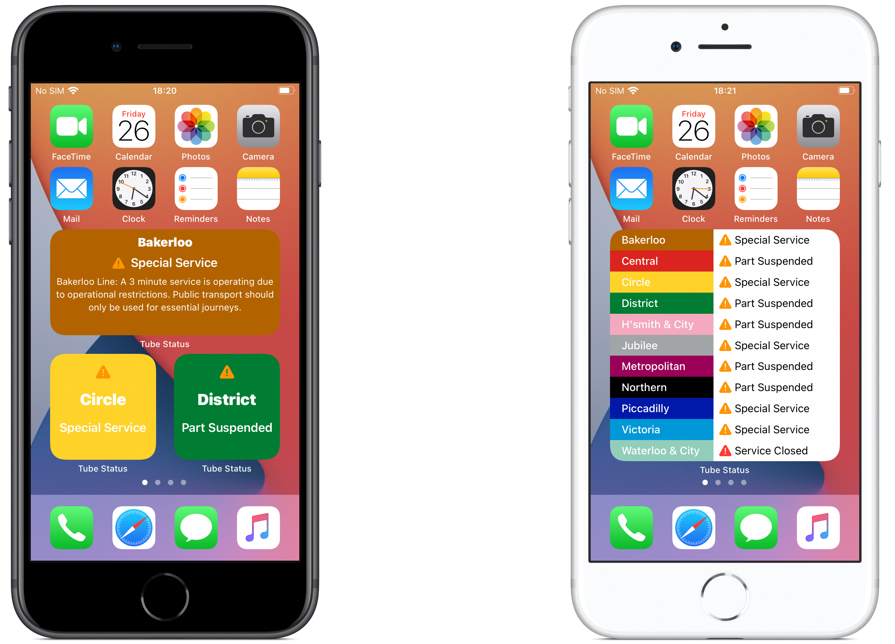
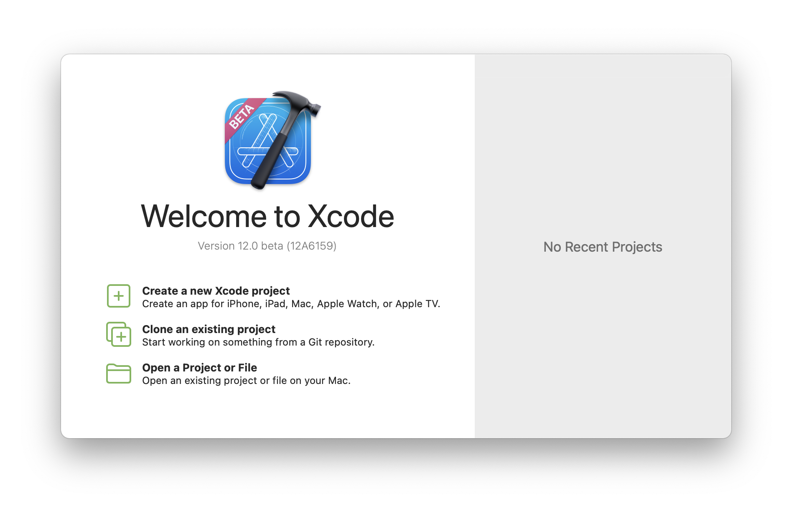
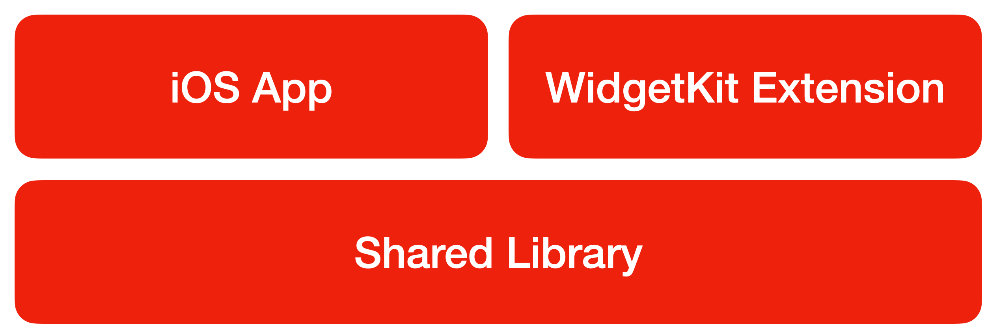
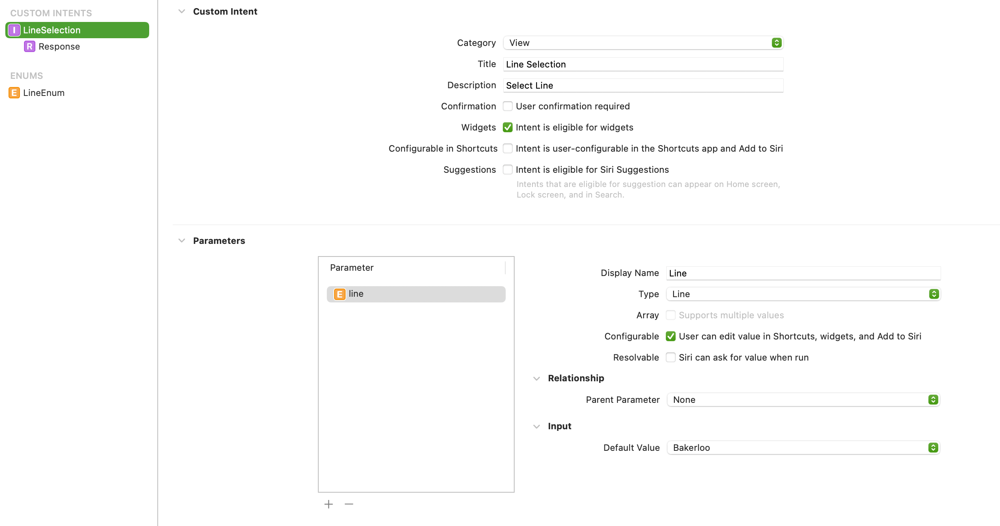
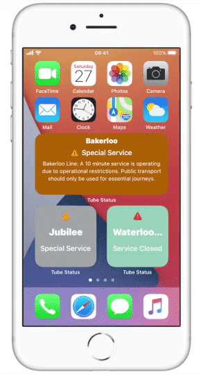

One of iOS 14’s most exciting changes for both users and developers will undoubtedly be it’s addition of widgets for quick access to information directly from the home-screen without having to open the app. This type of functionality has previously been limited to just two first-party applications (Calendar and Clock).


_London Underground status home-screen widgets on iOS 14_

In this article, I will detail how to quickly and easily create a home-screen widget for your app, using the London Underground status board as a real-world example. Transport for London provides a free-to-use Open API ([https://api.tfl.gov.uk](https://api.tfl.gov.uk])) we can easily utilise that will allow us to get up-to-date status for all its services.

Sample code for the project is available on GitHub:

> prettylink https://github.com/Oliver-Binns/tube-status-ios
> image /Images/tube-status-ios-github.png
> title Oliver-Binns/tube-status-ios
> description A sample iOS app for displaying the status of the London Underground using WidgetKit. – Oliver-Binns/tube-status-ios


## Getting Started
### Requirements

Developing for iOS 14 requires Xcode 12. Xcode 12 will run on any Mac which is running either macOS 10.15 (Catalina) or macOS 11.0 (Big Sur). You can download it from the beta software tab on the Apple Developer Downloads page: [https://developer.apple.com/download/](https://developer.apple.com/download/)

You can run widgets in the simulator, but to take full advantage of this tutorial, including supporting multiple widgets and intents it’s best to have a device running iOS 14 or later.

### Project Setup

_Widgets cannot be provided standalone, so we will need to start with a boilerplate app. Here we will setup a new Xcode project and produce a basic app. If you are a seasoned app developer, you may want to skip to the “Your First Widget” section._

In order to get started, let’s select “Create a new Xcode project” from the Xcode launch screen. Select app, then next.


_Xcode 12 Launch window_

WidgetKit requires “SwiftUI” as the interface so we will use this for our app too.

* Enter a name for your project
* Enter your own name, or company name under “Organization Identifier”.
* Select “SwiftUI” to use for the “Interface”
* Use “SwiftUI App” as the Lifecycle
* Use “Swift” as the language.

This article won’t go into detail about how to test your app, but feel free to leave the “Include Tests” box checked.

Then, finally, choose a location to store your app on your Mac.
Xcode will generate an app template containing `YourProjectApp.swift`.

### Architecture

In order to share code between the main-app and widget, we can create a shared framework in Xcode. This isn’t completely necessary for a simple app such as this, but it’s good practice as you may want to share logic further if you are implementing other features such as Siri Shortcuts or iMessage apps.


_Architecture of London Underground app_

Create a new framework in Xcode, go to File → New → Target… and select Framework. Some common product names for shared frameworks are “Core” or “Shared”. From now on, it’s easiest to create all new source files within this new shared framework target.

### Model

We need to create a model to represent our data. Using Swift’s Codable protocol we can automatically decode the JSON response from the TfL API.

```
public struct LineStatusUpdate: Identifiable, Decodable {
    enum CodingKeys: String, CodingKey {
        case id
        case line = "name"
        case statuses = "lineStatuses"
    }
    public let id: String
    let line: Line
    let statuses: [StatusUpdate]
}
```

In order to keep our variable names “Swifty”, we can use coding keys to map from the response that the API returns:

```
{
    id: "bakerloo",
    name: "Bakerloo",
    lineStatuses: [ ... ]
}
```

The full model used to build the app can be found in the sample code, linked at the bottom of this article.

### Networking

We can implement a NetworkClient to handle our API calls. We will use URLSession from the [Foundation](https://developer.apple.com/documentation/foundation) library to do this.

```
import Foundation

public final class NetworkClient {
    private let session: URLSession = .shared

    enum NetworkError: Error {
        case noData
    }

    func executeRequest(request: URLRequest, completion: @escaping (Result<Data, Error>) -> Void) {
        session.dataTask(with: request) { (data, response, error) in
            if let error = error {
                completion(.failure(error))
                return
            }
            guard let data = data else {
                completion(.failure(NetworkError.noData))
                return
            }
            completion(.success(data))
        }.resume()
    }
}
```

Create a new service to call the `NetworkClient` and decode the API data into the model we implemented earlier.

```
import Foundation

public struct StatusService {
    public static func getStatus(client: NetworkClient, completion: (([LineStatusUpdate]) -> Void)? = nil) {
        runStatusRequest(.lineStatus, on: client, completion: completion)
    }

    private static func runStatusRequest(_ request: URLRequest,
                                         on client: NetworkClient,
                                         completion: (([LineStatusUpdate]) -> Void)? = nil) {
        client.executeRequest(request: request) { result in
            switch result {
            case .success(let data):
                let decoder = JSONDecoder()
                do {
                    let lineStatus = try decoder.decode([LineStatusUpdate].self, from: data)
                    completion?(lineStatus)
                } catch {
                    print(error.localizedDescription)
                }
            case .failure(let error):
                print(error.localizedDescription)
            }
        }
    }
}
```

### Views

SwiftUI is great for quickly creating user interfaces for your application.
The app template will already include a ContentView, but we can create new views within the shared framework. As long as we declare that these views are public, they will be accessible from both the application and (later on!) our widget extension.

```
public struct LineStatusView: View {
    let update: LineStatusUpdate
    var body: some View {
        HStack {
            Text(update.line.displayName)
                .font(.subheadline)
                .fontWeight(.medium)
                .padding()
                .background(update.line.color)
            if let status = update.statuses.first {
                Text(status.type.rawValue)
                    .font(.subheadline)
                    .padding()
            }
        }
    }
}
```

This code creates a view showing the name of the tube line and the first status that is returned by the API.

Make sure to import the shared framework at the top of the file when you want to use this new view.

```
import Shared

LineStatusView(update: update)
```

You can use this new view in the content view of your app to display the status of each of the lines when the app is opened. 
Now we have a simple working app, we can look at displaying the view on the home-screen too!

## Your First Widget
### Create the Target

Let’s begin implementing our widget. First, we need to create a new target. 
In Xcode, go to File → New → Target… and then select the Widget Extension template. 
Enter a name for your Widget and uncheck “Include Configuration Intent”- we will not need this for our first, basic widget.

Xcode has now created a template widget for us. 
There are boilerplate implementations of `TimelineProvider`, `TimelineEntry` and `Widget` that we can add our implementation to. 
From now on, create the new source files within the newly created widget folder.

### Timeline Provider & Timeline Entry

The timeline provider works on a similar concept to `CLKComplicationDataSource` which is used for creating complications for the Apple Watch. 
We can provide an array of data entries from the current time into the future. 
This is useful for apps, such as the weather app which can provide entries for future forecasts in one go, reducing amount of refreshes that are needed.
 For our transport status app, we are obviously unable to predict future disruption so we will only provide one entry- the current status.

The `TimelineEntry` for our status update can use the models from our shared library that we created above:

```
struct StatusUpdateEntry: TimelineEntry {
    let date: Date?
    let updates: [LineStatusUpdate]
}
```

The TimelineProvider protocol requires us to implement two methods:

```
func snapshot(with context: Self.Context, completion @escaping (Self.Entry) -> ())
```

The snapshot method is called when we need to provide a short-lived display of our widget, such as from the widget selection menu.
The Apple documentation suggests that sample data is used here, if required, to allow the snapshot to return as quickly as possible.

```
func timeline(with context: Self.Context, completion: @escaping (Timeline<Self.Entry>) -> ())
```

The timeline method is called when the widget is being displayed normally, on the home-screen of the device.
We need to return a timeline of entries. In our transport status example, we are only able to return a single entry.
We can set the expiry date of the timeline to be two minutes into the future so that we are regularly refreshing the widget with the latest up-to-date information.

```
public func timeline(with context: Context,
                     completion: @escaping (Timeline<Entry>) -> ()) {
    // Fetch the latest travel information from the API
    StatusService.getStatus(client: NetworkClient()) { updates in
        let entry = SimpleEntry(date: Date(), updates: updates)
        // Refresh the data every two minutes:
        let expiryDate = Calendar
            .current.date(byAdding: .minute, value: 2, 
                          to: Date()) ?? Date()
        let timeline = Timeline(entries: [entry], 
                                policy: .after(expiryDate))
        completion(timeline)
    }
}
```

### Widget

The widget implementation uses the `@main` property wrapper, new in Swift 5.3, to mark it as the entry point to our widget.

We provide a `WidgetConfiguration` as the body for this. 
The widget configuration requires a placeholder view, which is displayed while our widget is loading, and the timeline provider we discussed above.

We can use modifiers to specify name and description that will be shown to the user when they are selecting a widget to add to their home-screen. 
We can also specify which widget sizes we support. In the case of our Tube Status widget, as it will contain quite a lot of information, we should add `.supportedFamilies([.systemLarge])`.

We build the view inside the widget configuration in the same way as we build our `WindowGroup` in the main app.

```
@main
struct AllLinesWidget: Widget {
    public var body: some WidgetConfiguration {
        StaticConfiguration(kind: "All Lines",
                            provider: AllLinesProvider(),
                            placeholder: AllLinesPlaceholderView()) { entry in
            ContentView(updates: entry.updates)
        }
        .configurationDisplayName("Tube Status")
        .description("See the status board for all underground lines")
        .supportedFamilies([.systemLarge])
    }
}
```

## Multiple Widgets
### Widget Bundle

We can provide multiple types of widget using the WidgetBundle protocol.
This is fairly simple to use, we can just build our group of widgets in the same way we build a SwiftUI view.

```
@main
struct TubeWidgets: WidgetBundle {
    @WidgetBundleBuilder
    var body: some Widget {
        AllLinesWidget()
    }
}
```

When you add main here, make sure you remove it from the widget itself- otherwise the Swift compiler won’t be able to work out which is the correct entry-point for our app.

We can add as many different types of widget as we like here:

```
var body: some Widget {
    MyFirstWidget()
    MySecondWidget()
    MyThirdWidget()
}
```

## Providing Customisation
### Intents

The above example works well if we want to display status information for all lines, but what if our user only travels on one particular line?
We could create a new widget for each line, but this quickly becomes messy and our widget selection menu would require the user to swipe through a lot of lines to find the one that they are interested in.
And what about if we wanted to also provide widgets for buses, DLR and other transport modes?

We can use Intents to allow the user to configure a single widget for the line they want to see. Using WidgetBundles, we can keep our original status widget and implement an additional widget using an intent with `IntentTimelineProvider`.

Let’s start by creating the Intent. If you have implemented something using Siri Shortcuts before, you will likely already be familar with intents.

Create a new intent definition file: File → New → File → SiriKit Intent Definition File. Ensure that this file is included in both the app target and the widget extension.

We can create a new enum datatype to hold the different Line options:


_Create an enum for the different Tube line options using the visual editor_

The unknown case is not displayed in the picker, but we can use it later for specifying a default value.

Next we need to create a new Custom Intent:
Add a title and description so that the user knows what they are choosing.
The Intent needs to be eligible for widgets, but Siri Shortcuts and Suggestions are not needed for this.


_Create a custom intent to allow the user to select a Line for the widget_

We also need to declare the intent in the application’s `Info.plist` file, otherwise it won’t be able to load in the “Edit Widget” modal.
```
<key>NSUserActivityTypes</key>
<array>
    <string>LineSelectionIntent</string>
</array>
```

### Intent Timeline Provider

In order to support intents, we need to conform our timeline provider to `IntentTimelineProvider` rather than `TimelineProvider`. 
This protocol is very similar but passes the intent into `snapshot` and `timeline` methods.

We can use this intent parameter to retrieve the user parameters that have been specified.

```
public func snapshot(for configuration: LineSelectionIntent,
                     with context: Context,
                     completion: @escaping (SimpleEntry) -> () {
    let line = self.line(for: configuration)
    StatusService.getStatus(client: NetworkClient(), for: line) {
        let entry = LineStatusUpdateEntry(date: Date(), 
                                          line: line,
                                          updates: updates)
        completion(entry)
    }
}
```

A simple `line` method will be able to map from the autogenerated Intent enum to the `Line` enum in our model:

```
func line(for configuration: LineSelectionIntent) -> Line {
    switch configuration.line {
        case .circle:
            return .circle
        case .district:
            return .district
        ...
    }
}
```

### Intent Configuration

We can now set up our new widget with an `IntentConfiguration`.
This is similar to the `WidgetConfiguration` we have used previously but requires us to specify the Intent type.

```
struct SingleLineWidget: Widget {
    public var body: some WidgetConfiguration {
        IntentConfiguration(kind: "Single Line",
                            intent: LineSelectionIntent.self,
                            provider: SingleLineProvider(),
                            placeholder: SingleLinePlaceholderView()) { entry in
            ...
        }
        .configurationDisplayName("Line Status")
        .description("See the status for a specific London Underground line")
        .supportedFamilies([.systemSmall, .systemMedium])
    }
}
```

It works! We can use our intents to select a particular tube line for our widget to display:


_Use intents to select a Tube Line_

## More Resources

Sample code available on GitHub:

> prettylink https://github.com/Oliver-Binns/tube-status-ios
> image /Images/tube-status-ios-github.png
> title Oliver-Binns/tube-status-ios
> description A sample iOS app for displaying the status of the London Underground using WidgetKit. – Oliver-Binns/tube-status-ios


Apple’s Developer Documentation:

> prettylink https://developer.apple.com/news/?id=yv6so7ie
> image /Images/widget-code-along.jpg
> title Widgets code-along – WWDC20 – Apple Developer
> description Come and build a widget with us! Download a starter app and code along as we create a widget from start to finish.

> prettylink https://developer.apple.com/documentation/widgetkit
> image /Images/widgetkit-docs.png
> title WidgetKit – Apple Developer Documentation
> description Show relevant, glanceable content from your app on the iOS Home screen or macOS Notification Center.
