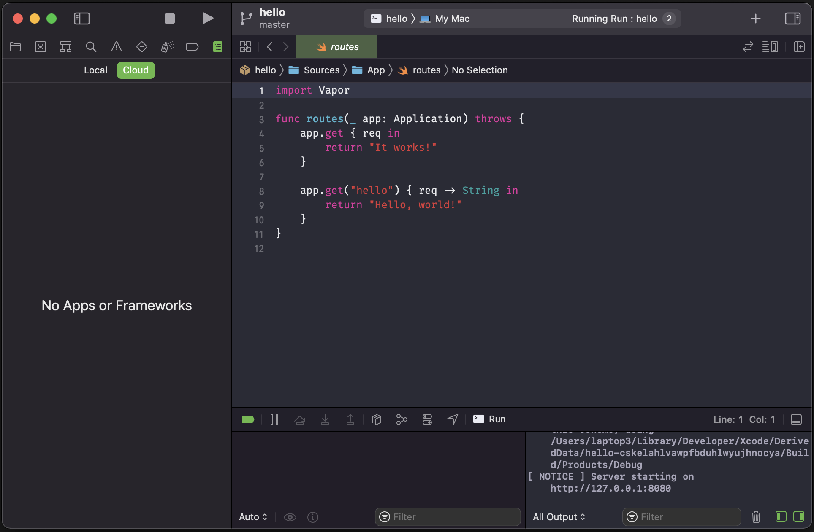

## Anticipation

Ever since Apple acquired BuddyBuild back in 2018 there has been been speculation on what it’s plans are for providing automation infrastructure and tooling as part of its offering to developers. Indeed, when our team ran a [sweepstakes for WWDC 2020](https://twitter.com/Oliver_Binns/status/1275044058893815808?s=20), based on the format from the [StackTrace podcast](https://podcasts.apple.com/gb/podcast/stacktrace/id1359435443), it was the first item to be speculated on. It’s fair to say, that when Apple finally revealed the results of this at WWDC 2021, it was met with great excitement — at least from my team at work.

Xcode Cloud promises an easy to setup, secure, automated workflow for your apps, heavily integrated with Xcode and App Store Connect. But does it meet these promises? I attempted to build a pipeline similar to one I’ve previously written about to find out. You can find the demo pipeline [in the repository for my open-source London Underground widgets](https://github.com/Oliver-Binns/tube-status-ios).

> prettylink https://www.macrumors.com/2018/01/02/apple-acquires-buddybuild-for-xcode-team/
> image /Images/buddybuild.png
> title Apple Acquires Canadian App Development Startup Buddybuild
> description Apple recently purchased Vancouver-based app startup Buddybuild, according to a blog post on the Buddybuild website (via iMore). Buddybuild’s...

> prettylink /posts/gitflow-automation/
> image /Images/git-flow.jpg
> title Gitflow with Automation for Mobile Apps
> description Gitflow is a great branching strategy for mobile apps. Automation is essential for achieving our agile principle of delivering working software frequently. Combining these two processes can reduce the burden of deployment, helping us focus on regularly delivering great apps for our users.

## Setup

There’s nothing much to say here, which in itself says a lot. You’ll need to enable Automatic Code Signing (if you haven’t already), but once you do, in true Apple-style, “it just works”. I think this is the first time I’ve used a CI/CD provider where the build passes on the first run with no code-signing issues and no missing dependencies.

Great work, Apple! ✅

## Integration
### Apple Tools

The biggest differentiator of Xcode Cloud from its competition is that it’s built right into Xcode and App Store Connect. You complete the initial setup within Xcode and you can view the results of your builds in both of these places. Combining this with the pull request support in Xcode 13, developers may have little reason to leave the IDE in a few years time. Should we expect an XcodeOS (à la Chrome OS) to be announced in 2025.

### Other Tools

Xcode Cloud works with Bitbucket, GitHub and GitLab version control providers. According to a highly [unscientific Twitter poll](https://twitter.com/Oliver_Binns/status/1460527189284249607?s=20), it looks like this should work for around 100% of teams. If you happen to use Azure DevOps (like me) – unlucky!

### Build Scripts

Xcode Cloud allows you to implement your own build scripts at specific points in the workflow: after cloning the code, before running the build and then after running the build. Since one of the main selling points of Xcode Cloud is that it’s quick to setup and simple to use, the more custom scripts we implement, the less value we are getting from this, but it’s nice to know we have this power if we need it.


*The Xcode Cloud Workflow Lifecycle, © Apple, 2021.*

We just need to create a file called `ci_post_clone.sh`, `ci_pre_xcodebuild.sh` or `ci_post_xcodebuild.sh` in a folder called `ci_scripts`. Since Xcode Cloud agents have Homebrew pre-installed and configured, we’re able to quickly add most the tools we would use in iOS Development, including SwiftLint and Fastlane.

Don’t forget to make your scripts executable using `chmod +x script_name`!

If I’m honest, I’d love to see some additions to the pre-installed software here as build times are pretty lengthy when I have to install all my dependencies first. For comparison, I’ve made pretty good use of Azure DevOps in the past and [their agents already come with both Fastlane and SwiftLint pre-installed](https://github.com/actions/virtual-environments/blob/main/Images/macos/macos-11-Readme.md).

#### SwiftLint

SwiftLint is a great way to ensure your whole codebase uses a consistent style. We can install it on Xcode Cloud by adding the following command in our post-clone (or other) script:

```
brew install swiftlint
```

It’s then trivial to run the tool, though we will need to pass in the path to our source code, which is helpfully provided by the `$CI_WORKSPACE` environment variable. There are a number of useful environment variables that are available during our builds, so it’s well worth reading through [the documentation](https://developer.apple.com/documentation/xcode/environment-variable-reference).

```
swiftlint --strict $CI_WORKSPACE
```

When running SwiftLint on the CI, I use the strict flag. This ensures that the whole team are following the code-style when merging into shared branches and prevents our project from building up with a large number of warnings, which may prevent more important issues from being surfaced.


#### Fastlane

Fastlane can be installed in a very similar way to SwiftLint. Fastlane really supercharges our automation with a [vast number of plugins](https://docs.fastlane.tools/plugins/available-plugins/) that can help us integrate with a wide number of services. No doubt, Apple see Xcode Cloud as an alternative for some of Fastlane’s functionality, but with such a wide array of integration with third-party services (i.e. ability to upload symbol files to Firebase Crashlytics), it’s unlikely that it’s going to replace everything.

I’m not going to go into detail of what Fastlane plugins might be useful — there are other blog posts for that — but one example could be to add an “Alpha” or “Beta” badge to your app icon, so you can distinguish between them on the home-screen.

First we’d need to install the dependencies, once our clone is complete:

```
#!/bin/sh
set -e

brew install fastlane
fastlane add_plugin badge
```

Next, once we’re about to build, we should add the badge to our icons:

```
#!/bin/sh
set -e

if [ "$CI_WORKFLOW" = "Alpha Release" ];
then
    (cd $CI_WORKSPACE && fastlane badge_alpha)
elif [ "$CI_WORKFLOW" = "Beta Release" ];
then
    (cd $CI_WORKSPACE && fastlane badge_beta)
fi
```

> prettylink https://fastlane.tools
> image /Images/fastlane.png
> title fastlane - App automation done right
> description The easiest way to build and release mobile apps. fastlane handles tedious tasks so you don’t have to.

#### SonarQube

I went down a bit of a rabbit-hole attempting to run SonarQube on Xcode Cloud. Suffice to say, it’s possible and should be easy enough for you to follow my lead.

I’ve spun off a separate article for this if you’re interested to find out how:

> prettylink /posts/sonarqube-xcodecloud/
> image /Images/hammer-sonar.png
> title Attempting SonarQube Analysis on Xcode Cloud
> description SonarQube can be a great tool for finding smells, bugs and duplications in your code. We can use the Fastlane plugin for SonarQube to output a report from our Xcode Cloud builds.

### Communication

When builds complete, we often want to perform actions depending on whether they pass or fail. Xcode Cloud has a few options here, but it’s not as exhaustive as I’d like. The only options so far are to output to Slack or email. These are both great for letting our team know what’s happened, especially if something goes wrong or if there are new features to be tested. If you use another messaging platform, you’re out of luck for now, unless you implement a custom `ci_post_xcodebuild.sh` script yourself.

There’s also no support for any project management tools (i.e. Jira) yet, so I guess we will continue forgetting to move our tickets across the scrum board just like we always have!

## Parallel Testing

One area where Xcode Cloud shines is allowing you to run your tests against multiple types of devices in parallel. I’ve attempted to do this locally, since parallel simulator testing was introduced in Xcode 9, but, at least for me, this has always ended up with the tests becoming flaky and randomly failing much more often: particularly with XCUITest cases. I’ve not written a massive number of tests yet, but I’ve not come across any non-deterministic behaviour so far.

What’s also worth noting here is that Xcode Cloud does run all these tests inside simulators of the device. If you want to test your apps on physical devices, you’ll still need your own device farm or to use something like [BrowserStack’s App Live](https://www.browserstack.com/app-live).

> prettylink https://useyourloaf.com/blog/xcode-10-random-and-parallel-tests/
> image /Images/use-your-loaf.png
> title Xcode 10 Random And Parallel Tests
> description Xcode 10 introduces three new options for running your tests. These allow you to randomize the execution order, speed up the tests by running them in parallel on multiple simulators and finally to control if Xcode automatically adds new tests to a scheme.


## Vendor Tie-in

Perhaps this isn’t surprising from Apple, but the easy setup comes with the cost of heavy tie-in. There’s no way to import or export a pipeline from anywhere else. I have a feeling that it’s going to be a bit of an outlier in the future particularly as other providers move further towards pipelines, infrastructure and repository policies that are defined in code rather than using UI tools.

## Server-side Code

Swift as a general purpose language is growing in popularity even outside of the Apple ecosystem. It’s being used to create server-side APIs in production by many companies around the world. Xcode Cloud is designed with Apple Platforms in mind but unfortunately, for the moment, this is limited to iOS, macOS, tvOS and watchOS apps. If you’re using something like Vapor to build your backend API, you’ll be greeted by this “No Apps or Frameworks” message. If you’re making use of (and paying for!) another CI/CD provider, then it’s probably harder to justify having two different solutions, but once Apple announce the pricing we’ll be able to know for sure.



*A Hello World Vapor Swift App, Xcode Cloud builds are unavailable.*

## Summary

Xcode Cloud is probably going to work great for you if you’re new to automation or don’t have any CI/CD workflow setup for your project yet. Depending on the pricing, I’ll be happy to continue using it for my standalone side-projects. However, for me, it’s not quite compelling enough to invest time in switching over an existing pipeline from another provider.

In the future, I’d love to see some additions to the pre-installed software (SwiftLint and Fastlane in particular), access to the code in the post-testing step (see my SonarQube post) and support for server-side Swift projects.

How have you found Xcode Cloud? Are you going to adopt it? Let me know on Twitter:

> prettylink https://bsky.app/profile/oliverbinns.co.uk
> image /Images/profile-yellow.jpg
> title Oliver Binns | Bluesky
> description The latest posts from Oliver Binns. iOS Development Craft Lead for @DeloitteDigital | Apple Alliance.
